# LaTiendita

**Sistema de inventario y fiados, offline-first, para tiendas de colonia de El Salvador.**


-f59e0b)

> Este repositorio es, por ahora, la **fase de diseño** del proyecto: el sistema de diseño completo
> y los mockups de pantalla, todo en HTML/CSS plano que se abre sin compilar nada. El objetivo del
> proyecto es impacto comunitario real, no monetización: **open source, sin costo, en español primero**.

---

## Tabla de contenidos

- [Qué es](#qué-es)
- [Estado del proyecto](#estado-del-proyecto)
- [Galería de pantallas](#galería-de-pantallas)
- [Sistema de diseño](#sistema-de-diseño)
- [Estructura del repositorio](#estructura-del-repositorio)
- [Cómo explorarlo (sin build)](#cómo-explorarlo-sin-build)
- [Cómo regenerar y verificar](#cómo-regenerar-y-verificar)
- [Accesibilidad y verificación](#accesibilidad-y-verificación)
- [Trazabilidad: capacidades → pantallas](#trazabilidad-capacidades--pantallas)
- [Decisiones de diseño](#decisiones-de-diseño)
- [Hoja de ruta](#hoja-de-ruta)
- [Atribución y licencias](#atribución-y-licencias)
- [Convenciones](#convenciones)
- [English summary](#english-summary)

---

## Qué es

LaTiendita digitaliza las dos libretas de papel que sostienen una tienda pequeña en El Salvador:

1. **El inventario** — qué hay, qué falta, cuánto queda. El stock **nunca se edita a mano**: es el
   resultado derivado de un **libro de movimientos inmutable** (entradas, salidas, ajustes y conteos).
2. **Los fiados** — la libreta de deuda por cliente, con cargos y abonos inmutables y saldo derivado.

Los usuarios de referencia (ver `specs/002-especificacion-funcional.md`):

| Persona | Rol | Contexto que manda en el diseño |
|---|---|---|
| **Marta** | dueña | Baja alfabetización digital, abre antes del amanecer, quiere cero configuración |
| **José** | empleado | Opera productos, movimientos y fiados; ve solo lo que su rol permite |
| **Carlos** | instalador | Monta la app una vez; necesita que sea un solo comando |

Reglas no negociables del producto: **offline-first** (todo funciona sin conexión; el aviso es
explícito: *"Sin conexión — se sincronizará al reconectar"*), **escaneo de códigos de barras con
entrada manual siempre disponible**, **PWA instalable**, **español con tú neutro**, y una
**puerta de salida sagrada** (exportar CSV/JSON y respaldo completo, sin dependencias).

---

## Estado del proyecto

El proyecto sigue un ciclo **Spec-Driven Development**: primero el spec, luego el diseño, y el spec
manda sobre el diseño (si algo contradice el spec, se cambia el spec primero).

| Fase | Entregable | Estado |
|---|---|---|
| Research de mercado y prior art | `specs/000`, `specs/001` | ✅ completo |
| Especificación funcional v1 | `specs/002` (C1–C11, personas, NFRs) | ✅ completo |
| Prompt de prototipado / sistema de color | `specs/005` | ✅ completo |
| **F1 · Fundaciones** | tokens DTCG light/dark + Tailwind + `DESIGN.md` + `decisions.md` | ✅ aprobado |
| **F2 · Componentes** | `preview.html` con los 9 componentes núcleo | ✅ aprobado |
| **F3 · Pantallas** | 13 pantallas × estados (60 marcos a 360×640) | ✅ lotes 1, 2 y 3 |
| **F4 · Cierre** | checklist WCAG 2.2 AA (`ACCESSIBILITY.md`) + lint + cobertura | ✅ entregado |
| Plan técnico (implementación) | `specs/003-plan-tecnico.md` | ⏳ no escrito |

Números actuales: **60/60 pares de contraste AA** en ambos modos, **13 pantallas / 60 marcos**,
**42 iconos** Lucide, **0 hallazgos** en la QA estática (`design/tools/qa.py`).

---

## Galería de pantallas

Cada pantalla es un frame fijo de **360×640** con al menos cuatro estados honestos
(`default · vacío · sin conexión · error`, y extras donde el flujo los necesita). La composición es
fija: **encabezado → banner de conexión → contenido → CTA fija → navegación inferior**; el banner es
un hermano del layout bajo el encabezado, nunca un overlay.

Las imágenes de abajo son sólo el estado *default*; cada enlace lleva a la **hoja de estados completa**
en ambos temas donde aplica.

<table>
<tr>
<td align="center" width="33%">
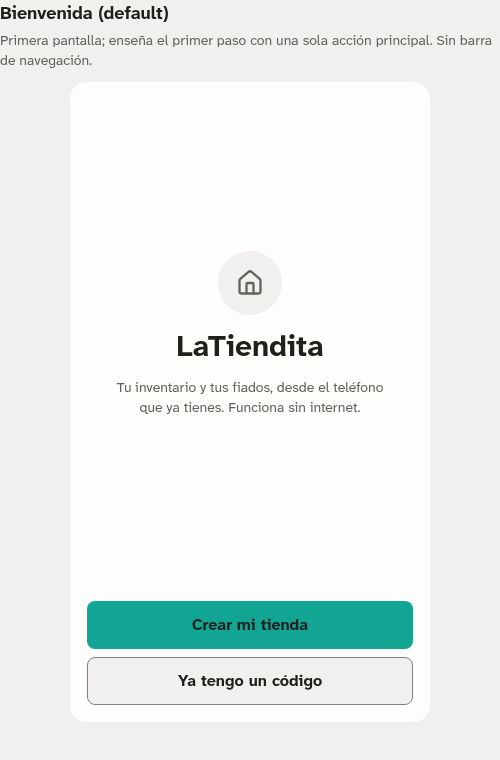<br>
<b>1 · Crear tienda</b><br><sub>Bienvenida · vacío · sin conexión · error</sub><br>
<a href="design/screens/01-crear-tienda-light.png">hoja de estados →</a>
</td>
<td align="center" width="33%">
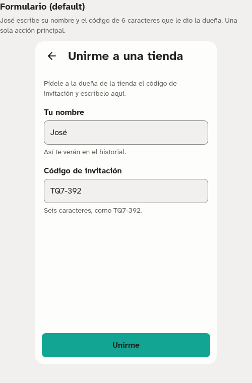<br>
<b>2 · Unirse con código (José)</b><br><sub>formulario · vacío · sin conexión · código inválido</sub><br>
<a href="design/screens/02-unirse-light.png">hoja de estados →</a>
</td>
<td align="center" width="33%">
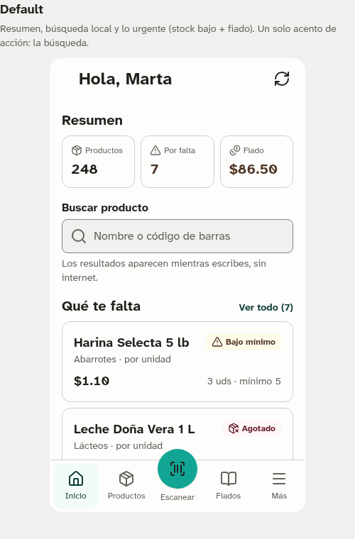<br>
<b>3 · Inicio</b><br><sub>default · vacío · sin conexión · error de carga</sub><br>
<a href="design/screens/03-inicio-light.png">hoja de estados →</a>
</td>
</tr>
<tr>
<td align="center" width="33%">
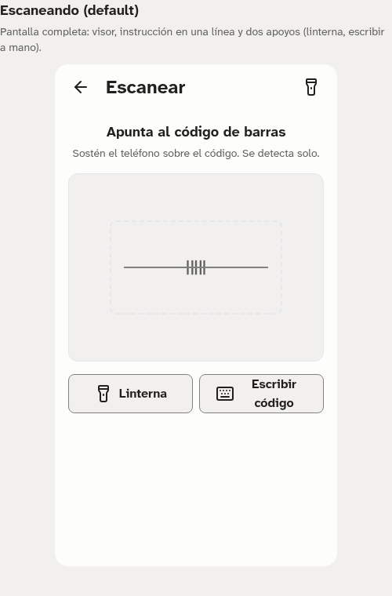<br>
<b>4 · Escáner</b><br><sub>escaneando · entrada manual · conocido · offline · error de cámara</sub><br>
<a href="design/screens/04-escanear-light.png">hoja de estados →</a>
</td>
<td align="center" width="33%">
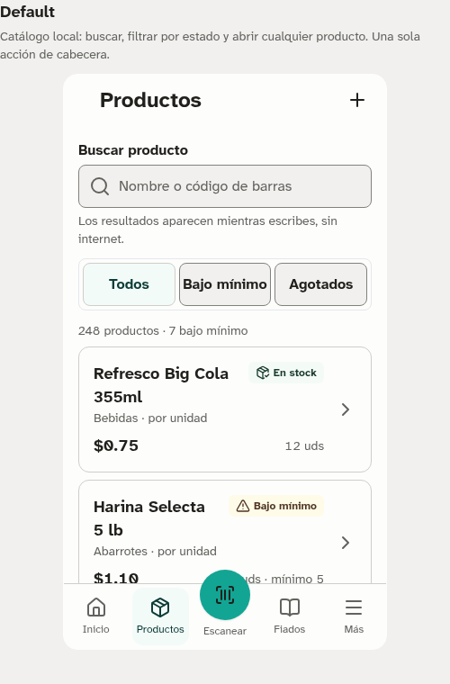<br>
<b>5 · Productos (catálogo)</b><br><sub>default · vacío · offline · sin resultados · error</sub><br>
<a href="design/screens/05-productos-light.png">hoja de estados →</a>
</td>
<td align="center" width="33%">
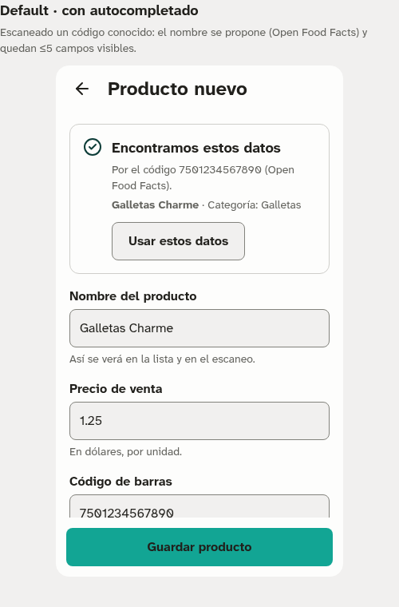<br>
<b>6 · Producto nuevo</b><br><sub>autocompletado · vacío · offline · error · guardado</sub><br>
<a href="design/screens/06-nuevo-producto-light.png">hoja de estados →</a>
</td>
</tr>
<tr>
<td align="center" width="33%">
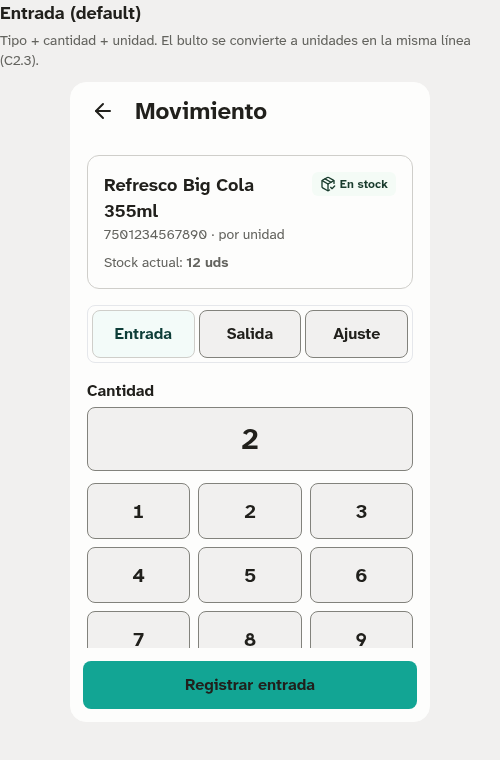<br>
<b>7 · Movimiento rápido</b><br><sub>entrada · salida · vacío · offline · error de stock</sub><br>
<a href="design/screens/07-movimiento-light.png">hoja de estados →</a>
</td>
<td align="center" width="33%">
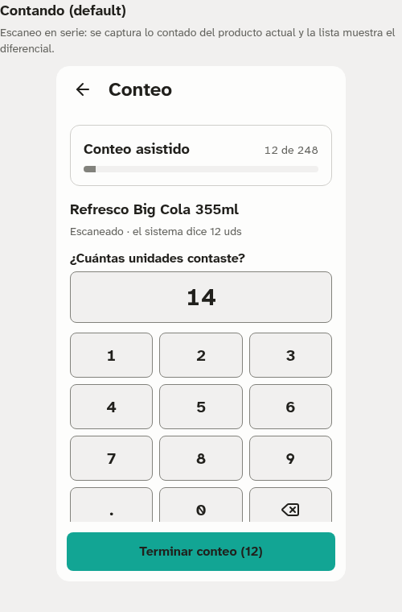<br>
<b>8 · Conteo asistido</b><br><sub>contando · vacío · offline · código desconocido · resumen</sub><br>
<a href="design/screens/08-conteo-light.png">hoja de estados →</a>
</td>
<td align="center" width="33%">
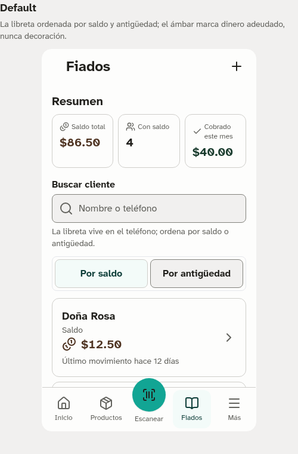<br>
<b>9 · Libro de fiados</b><br><sub>default · vacío · sin conexión · error de carga</sub><br>
<a href="design/screens/09-fiados-light.png">hoja de estados →</a>
</td>
</tr>
<tr>
<td align="center" width="33%">
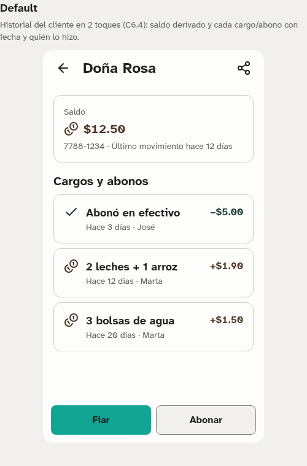<br>
<b>10 · Detalle de cliente</b><br><sub>default · vacío · offline · compartir · error</sub><br>
<a href="design/screens/10-cliente-light.png">hoja de estados →</a>
</td>
<td align="center" width="33%">
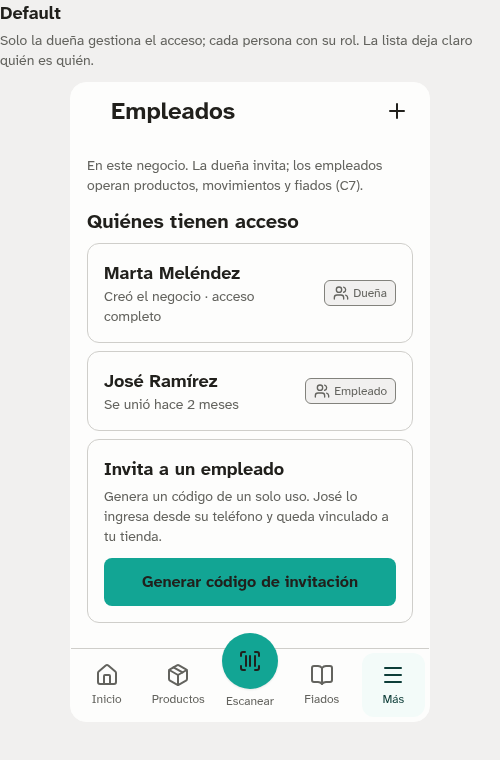<br>
<b>11 · Empleados</b><br><sub>default · vacío · código generado · offline · error</sub><br>
<a href="design/screens/11-empleados-light.png">hoja de estados →</a>
</td>
<td align="center" width="33%">
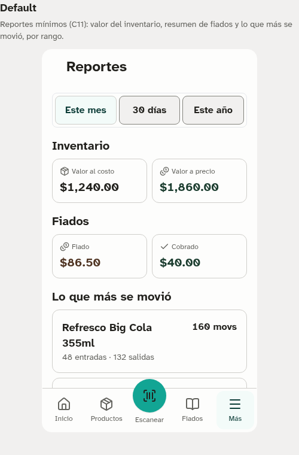<br>
<b>12 · Reportes mínimos</b><br><sub>default · vacío · sin conexión · error</sub><br>
<a href="design/screens/12-reportes-light.png">hoja de estados →</a>
</td>
</tr>
<tr>
<td align="center" width="33%">
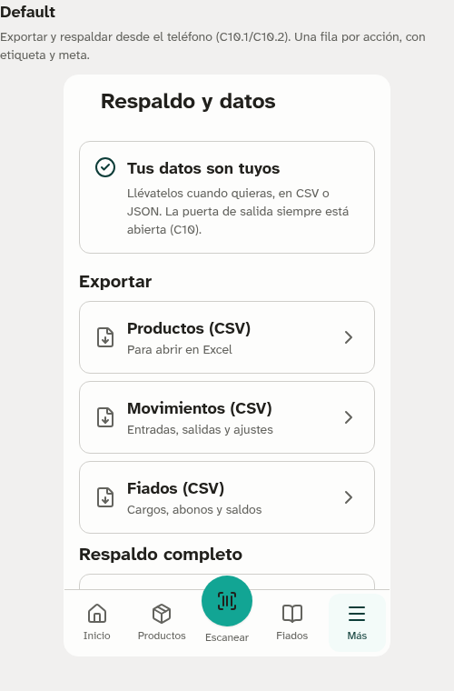<br>
<b>13 · Respaldo y datos</b><br><sub>default · respaldo listo · importar · offline · error</sub><br>
<a href="design/screens/13-respaldo-light.png">hoja de estados →</a>
</td>
</tr>
</table>

**Tema oscuro** (se activa por sistema o con el interruptor bajo «Más»):

<p>
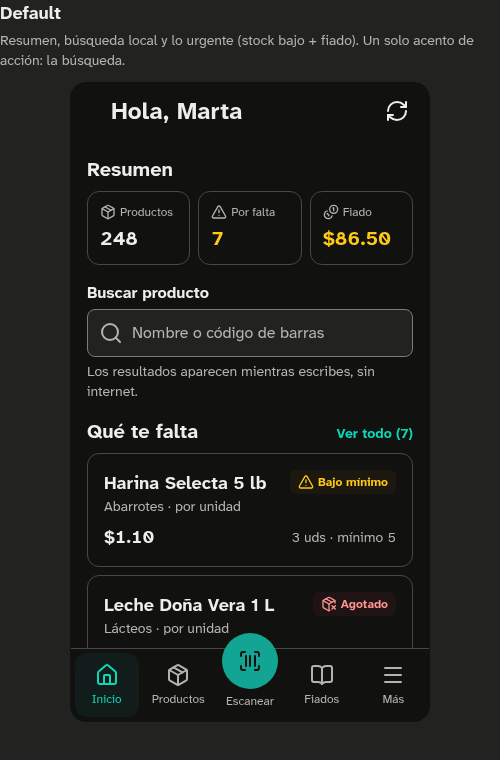
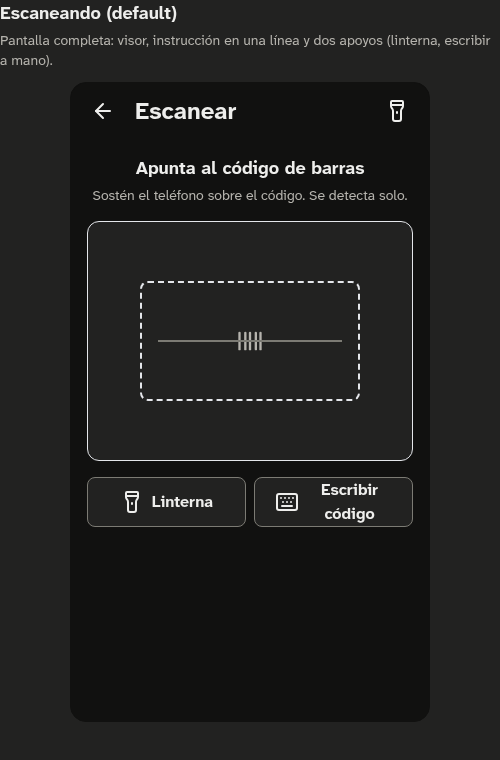
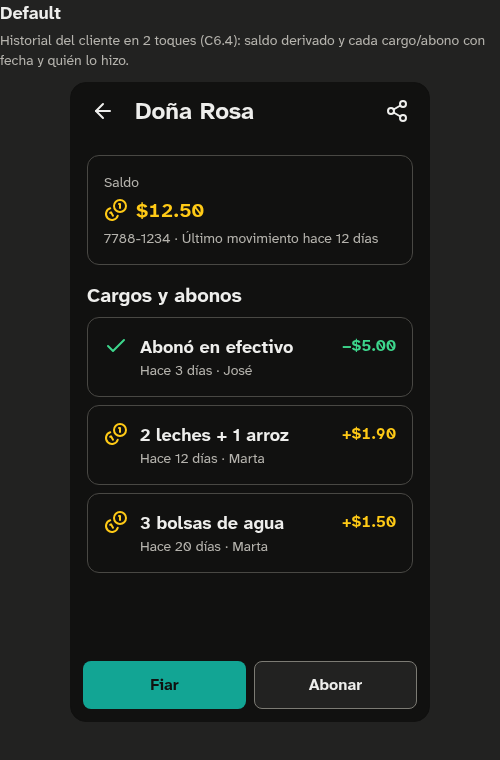
</p>

La galería de **componentes** de la fase 2 está en [`design/preview.html`](design/preview.html)
(capturas: [`preview-light.png`](design/preview-light.png) · [`preview-dark.png`](design/preview-dark.png)).

---

## Sistema de diseño

El sistema se deriva de cuatro palabras de marca — **clara · confiable · cercana · práctica** — y de
cinco «diales» que se traducen en valores concretos. No hay estilo improvisado: cada valor viene de un
token.

| Dial | Valor | Cómo se ve |
|---|---|---|
| Claridad | 80 | cuerpo ≥16px, etiquetas siempre visibles, icono + texto, estados vacíos que enseñan el primer paso, una acción primaria por pantalla |
| Densidad | 45 | rejilla de 4px, filas ≥56px, listas de 6–8 ítems, tarjetas con aire |
| Suavidad | 40 | radios 6/8/12/16 — amable, no «app de consumo» |
| Contraste | 75 | todo texto ≥4.5:1 con margen, bordes y anillos ≥3:1, estado nunca sólo por color |
| Movimiento | 15 | 80/120/180ms, opacidad + transform ≤4px, `prefers-reduced-motion` → 0ms |

**Color.** Una sola fuente: **Radix Colors v3** (vendorizada, MIT, sin CDN).

- **Teal** = acción / marca · **Sand** = neutros · **Amber** = dinero (fiados) y avisos de stock bajo.
- Semáforo de estado: verde (ok) · ámbar (bajo) · rojo (agotado/crítico).
- **Light + dark** sin código extra: el mismo rol semántico resuelve ambos modos.
- Dos desviaciones documentadas del uso por defecto de Radix (el texto del botón primario es oscuro,
  no blanco; el texto tintado usa el paso 12 en claro) — ver `decisions.md` DS-06/DS-07.

**Tipografía.** **Atkinson Hyperlegible Next** (variable 400–700, OFL, auto-hospedada) — diseñada por
el Braille Institute para legibilidad de baja visión, alineada con el dial de claridad. Base 16px.

**Iconografía.** **Lucide** (ISC, sprite de 42 símbolos) — siempre acompañado de texto visible.

**Contrato de tokens.** Los componentes usan sólo **roles semánticos** (`--color-action`,
`--color-danger-text`, …), nunca pasos crudos (`--teal-9`) ni hex. Los pasos crudos existen para
generación y auditoría.

---

## Estructura del repositorio

```
.
├── specs/                         # Spec-Driven Development (español)
│   ├── 000-research-competencia.md   Research LatAm/occidental (Loyverse, OSPOS, Grocy…)
│   ├── 001-research-global.md        Research global (Khatabook, Peddlr, jshERP…)
│   ├── 002-especificacion-funcional.md  Spec v1: capacidades C1–C11, personas, NFRs
│   ├── 005-prompt-opendesigner.md    Prompt maestro + sistema de color + fases
│   └── README.md                     Índice y estado de la sesión
└── design/
    ├── tokens/                    # FUENTE ÚNICA de verdad
    │   ├── tokens.json               Tokens DTCG (primitivos + semánticos, light/dark)
    │   ├── tokens.css                Custom properties = fuente en runtime
    │   ├── tailwind.theme.js         Puente Tailwind/shadcn (todo es var(--…))
    │   ├── generate.py               Regenera JSON+CSS desde Radix vendorizado
    │   ├── verify_contrast.py        Matriz WCAG 2.2 AA de 60 pares (lint)
    │   └── vendor/radix/             Radix Colors v3 + LICENSE (MIT, fijado)
    ├── assets/                    # Recursos de runtime (sin dependencias externas)
    │   ├── fonts/                    Atkinson Hyperlegible Next (WOFF2)
    │   ├── icons.svg                 Sprite Lucide (42 símbolos)
    │   ├── base.css · ui.css          Base + clases de componente
    │   ├── theme.js                  Interruptor de tema (claro/oscuro/sistema)
    │   └── tailwind.js               Tailwind vendorizado (runtime, sin CDN)
    ├── preview.html               # F2 · galería de los 9 componentes núcleo
    ├── screens/                   # F3 · 13 pantallas (HTML 360×640) + capturas
    ├── tools/                     # Generadores, render del shell y QA
    │   ├── shell.py                  Render del armazón (encabezado/banner/CTA/nav)
    │   ├── parts.py                  Piezas reutilizables (tarjetas, keypad, filas…)
    │   ├── batch1.py                 Pantallas 01–04
    │   ├── batch2.py                 Pantallas 05–09
    │   ├── batch3.py                 Pantallas 10–13
    │   └── qa.py                     QA estática (iconos, ids, etiquetas, offline)
    ├── DESIGN.md                  # Sistema de diseño completo (§0–§12)
    ├── ACCESSIBILITY.md           # Fase 4 · checklist WCAG 2.2 AA + verificación pendiente
    └── decisions.md               # Bitácora DS-01…DS-30 + ledger de verificación
```

Todo el árbol es **HTML/CSS/JS plano**: no hay bundler, framework ni paso de compilación.

---

## Cómo explorarlo (sin build)

No hace falta instalar nada para verlo. Desde la raíz del repo:

```bash
python3 -m http.server 8000
# luego abre:  http://localhost:8000/design/preview.html
#               http://localhost:8000/design/screens/03-inicio.html
```

También puedes abrir los HTML directamente con `file://`. (Nota: en un navegador headless puede
aparecer un aviso de *«unsafe attempt to load unique security origins»*; es un artefacto del modo
headless, no un defecto del diseño.)

---

## Cómo regenerar y verificar

```bash
# 1) Tokens: JSON + CSS desde Radix (determinista)
python3 design/tokens/generate.py

# 2) Lint de contraste: matriz WCAG 2.2 AA (60 pares) — debe dar 0 fallos
python3 design/tokens/verify_contrast.py

# 3) Pantallas: regenerar los mockups HTML
python3 design/tools/batch1.py     # pantallas 01–04
python3 design/tools/batch2.py     # pantallas 05–09
python3 design/tools/batch3.py     # pantallas 10–13

# 4) QA estática de las pantallas (iconos, ids, etiquetas, sin URLs externas)
python3 design/tools/qa.py         # 13 pantallas · 60 marcos · 0 hallazgos
```

Las capturas se generan con Chromium headless (captura de página completa a 500px de ancho, en
claro y oscuro donde aplica). El proyecto **no** depende de CDNs: Radix, Lucide, la fuente y Tailwind
están vendorizados para que funcione sin conexión.

---

## Accesibilidad y verificación

La accesibilidad no es un repaso final: es un contrato que se verifica automáticamente. El checklist
completo, criterio por criterio (WCAG 2.2 AA) y componente por componente, está en
[`design/ACCESSIBILITY.md`](design/ACCESSIBILITY.md).

| Verificación | Comando | Resultado |
|---|---|---|
| Matriz de contraste WCAG 2.2 AA (60 pares, 2 modos) | `python3 design/tokens/verify_contrast.py` | **0 fallos** (peor texto 4.71:1) |
| Generación de tokens reproducible | `python3 design/tokens/generate.py` | determinista desde `vendor/radix/` |
| JSON válido (DTCG con valores tipados) | `python3 -c "import json;json.load(open('design/tokens/tokens.json'))"` | ok |
| QA estática de pantallas (13 pantallas, 60 marcos) | `python3 design/tools/qa.py` | 0 iconos rotos · 0 ids duplicados · 0 etiquetas huérfanas · 0 URLs externas |

Puntos duros de accesibilidad e interacción:

- Objetivos táctiles **≥48px** (filas 56px, navegación 64px, teclas 56px).
- **Nunca sólo color**: cada estado lleva icono + texto o signo (`+`/`−` en fiados), no únicamente un tinte.
- Anillo de foco de **2px con offset de 2px** (teal-11) obligatorio; banner/CTA/nav son hermanos del layout, así que el foco no queda tapado.
- Etiquetas **siempre visibles** (nunca sólo placeholder); errores con icono, texto y `aria-invalid`/`aria-describedby`.
- Respeto de `prefers-reduced-motion` (movimiento → 0ms) y **light/dark** por sistema o interruptor.
- Aviso de conexión persistente y un badge «por sincronizar» en tono neutro, no alarmista.

Detalle de la matriz en `DESIGN.md` §2.3, el checklist AA en `ACCESSIBILITY.md` y el ledger en `decisions.md`.

---

## Trazabilidad: capacidades → pantallas

El spec define 11 capacidades (C1–C11). Las 13 pantallas diseñadas cubren todas las capacidades de
interfaz de la v1.

| Capacidad (spec `002`) | Pantalla(s) |
|---|---|
| C1 · Negocio, cuentas y accesos | 1 Crear tienda · 2 Unirse con código · 11 Empleados |
| C2 · Catálogo de productos | 5 Productos · 6 Producto nuevo |
| C3 · Escaneo de códigos de barras | 4 Escáner (cámara + entrada manual) |
| C4 · Movimientos de inventario | 7 Movimiento rápido |
| C5 · Stock, alertas y conteo | 3 Inicio («qué te falta») · 8 Conteo asistido |
| C6 · Fiados | 9 Libro de fiados · 10 Detalle de cliente (+ compartir C6.5) |
| C7 · Roles y permisos | 2 Unirse con código (rol empleado) · 11 Empleados |
| C8 · Offline-first y sincronización | presente en todas (banner + badge) |
| C9 · PWA | transversal (interfaz mobile-first fullscreen) |
| C10 · Respaldo y salida (CSV/JSON) | 13 Respaldo y datos |
| C11 · Reportes mínimos | 12 Reportes mínimos |

---

## Decisiones de diseño

Las decisiones están registradas y justificadas una por una en [`design/decisions.md`](design/decisions.md)
(con contexto, alternativas y desviaciones). Resumen:

- **DS-01…DS-04** — nombre, tipografía, registro de copy y modo oscuro.
- **DS-05…DS-12** — color: Radix como fuente única, texto oscuro sobre teal, amber sólo dinero,
  borde de input sand-10, anillo de foco teal-11.
- **DS-13…DS-15** — tamaño, espaciado y movimiento (48px, rejilla 4px, radios 6/8/12/16).
- **DS-16…DS-22** — arquitectura de tokens, badge neutro, mayúsculas nunca, `$5.00`, Lucide + texto.
- **DS-23…DS-27** — pantallas: frame 360×640, estados honestos, vacíos que enseñan, unirse requiere
  internet y lo dice, pantalla **Productos** añadida (hueco del spec, ver DS-26), controles
  segmentados de 48px en una línea.
- **DS-28…DS-30** — lote 3: filas de fiados con signo + tono (cargo ámbar / abono verde), invitar es
  lo único que requiere internet, y reportes/respaldo se calculan localmente.

> **Pendiente de revisión del dueño:** DS-26 propone añadir «Productos» como enmienda al spec `005`.

---

## Hoja de ruta

1. **Implementación — `specs/003-plan-tecnico.md`:** PWA offline-first (IndexedDB + outbox sync,
   last-write-wins por campo), escaneo con `BarcodeDetector` + fallback ZXing/WASM, libro de
   movimientos inmutable, RLS por negocio, `docker-compose` de 1 comando, presupuesto JS ≤150KB gzip /
   TTI ≤3s en gama baja. Incluye la QA de accesibilidad con lector de pantalla real y zoom 200%
   listada en `ACCESSIBILITY.md` §4.
2. **`specs/004-roadmap.md`:** hitos M0–M4 y plan de adopción.

Todas las fases de diseño (F1 fundaciones, F2 componentes, F3 pantallas con lotes 1–3, F4 cierre
WCAG) están **entregadas**; el proyecto pasa a la fase de implementación.

Pendientes abiertos registrados: variante «sin mínimo» de la tarjeta de producto, revisión de DS-26
por el dueño, y confirmar que el padding inferior de la navegación despeja el FAB central con datos reales.

---

## Atribución y licencias

- **Radix Colors v3** — MIT (`design/tokens/vendor/radix/LICENSE`).
- **Lucide** — ISC (`design/assets/icons.svg`).
- **Atkinson Hyperlegible Next** — SIL Open Font License (`design/assets/fonts/`).
- **Tailwind CSS** — vendorizado para uso sin conexión.

La **licencia del proyecto está por definir** (pregunta abierta **P1** del spec: MIT vs AGPL-3.0).
No se ha incluido un archivo `LICENSE` a propósito: se añadirá cuando el dueño cierre la decisión.

---

## Convenciones

- **Español primero** con **tú neutro** en toda la interfaz y en los documentos del proyecto.
- Montos en **USD** con formato `$5.00`; mayúsculas sólo donde el idioma lo exige.
- Todo artefacto es verificable: **si no se puede probar, no entra**.
- **El spec manda**: si el diseño contradice `specs/002`, se actualiza el spec primero y el diseño después.

---

## English summary

<details>
<summary>What this repository is (click to expand)</summary>

**LaTiendita** is the **design phase** of an open-source, offline-first inventory-and-credit («fiados»)
PWA for small neighborhood stores in El Salvador. It targets low-digital-literacy owners, works
entirely offline, and keeps Spanish as the first language.

What's here: a token-driven design system built on **Radix Colors v3** (Teal action / Sand neutrals /
Amber for money), self-hosted **Atkinson Hyperlegible Next**, a **Lucide** icon sprite, and **13 screen
mockups** (60 states at 360×640) rendered as plain HTML/CSS/JS with **no build step**. A full WCAG 2.2
AA checklist lives in `design/ACCESSIBILITY.md`.

Verification: a **60-pair WCAG 2.2 AA contrast matrix** (`design/tokens/verify_contrast.py`) passes in
both light and dark modes, and the design is fully reproducible from the scripts in `design/tools/`.

Explore it offline with `python3 -m http.server` and open `design/preview.html`. The product spec lives
in `specs/` (Spanish). Project license is still open (P1: MIT vs AGPL-3.0).

</details>
